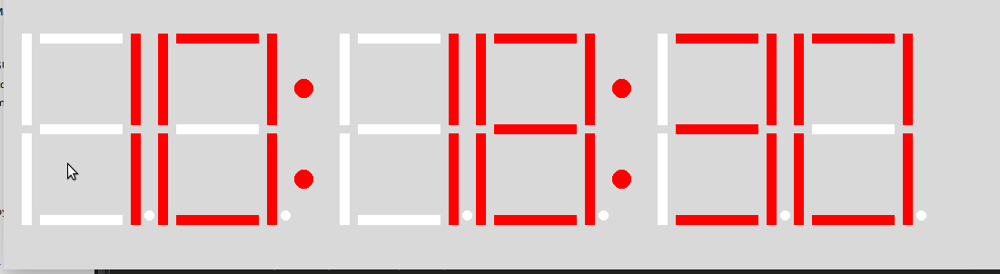

<h1>pySevSegment</h1>
A seven segment display simulator for python 2 or 3 
<h2>Usages</h2>
You can use this seven segment display only for displaying a digit on the Graphics Window. (tkinter canvas) 
You can make digital clocks , thermometer , stopwatch , timer , etc with this module. 
 
<h2>Installation</h2>
Just put the `graphics.py` and `sevSeg.py` file on the path of your program in which you will be using this. 
<strong>Actually no installation required at all.</strong> 
<h2>Examples</h2>
Examples are provided with this package. 
Browse the example file to watch some examples. 
<h2>ScreenShots</h2>

